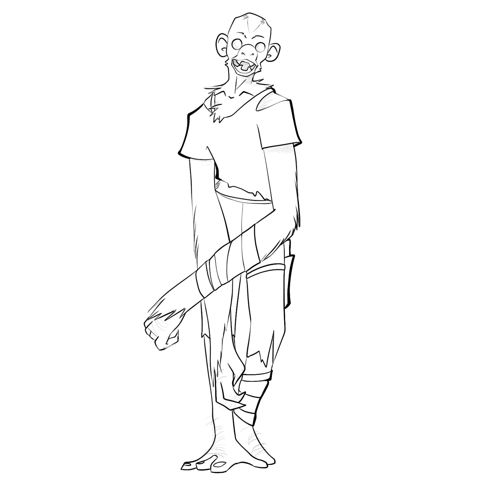

# October 3rd, 2021 (Challenge 2)

Prompt: **Misunderstood Monster**

### [Werechimp](https://github.com/mpanighetti/dnd5e-monsters/blob/main/humanoids/werechimp.md)

#### Description

Perhaps the least studied of lycanthropes, troganthropes tend to form tight-knit bands far away from human settlements to avoid persecution. Their societies are often found in dense jungles or tropical islands to help maintain their distance from society, and their interactions with humans are rare, often limited to the occasional wandering explorer or unfortunate shipwreck.

Asinius Avitus Scipio, self-proclaimed first-hand expert on this subject, has published multiple volumes full of spurious assertions about werechimps. In _"Writing with One Arm: Tips for Limb-Lacking Mages and Interesting Applications of Mage Hand"_, he makes offhanded claims that werechimps have a prediliction toward severing and consuming the arms of humanoids they encounter, but the medical record has scant examples to offer in his support. By any reputable accounts, werechimps can be sociable people, though they prefer to keep to themselves. Most instances of troganthropic curses are accidental or provoked by human aggressors.

_**Characters as Werechimps.**_ The _Monster Manual_ has rules for characters afflicted with lycanthropy. The following text applies to werechimp characters specifically:

A character cursed with werechimp lycanthropy gains a Strength of 16 if their score isn't already higher. Attack and damage rolls for the werechimp's bite are based on whichever is higher of the character's Strength and Dexterity.

<figure>
  
  <figcaption>Werechimp by <a href="https://linktr.ee/RedDrawnArt">RedDrawn Art</a></figcaption>
</figure>

#### Attributes

_Medium humanoid (any species, shapechanger)_

- **Armor Class** 12
- **Hit Points** 39 (6d8 + 12)
- **Speed** 30 ft. in humanoid form; 30 ft., climb 30 ft. in chimp and hybrid form

|  STR  |  DEX  |  CON  |  INT  |  WIS  |  CHA  |
|:-----:|:-----:|:-----:|:-----:|:-----:|:-----:|
|16 (+3)|15 (+2)|15 (+2)|12 (+1)|15 (+2)|14 (+2)|

- **Skills** Athletics +5, Intimidation +4, Perception +4
- **Senses** passive Perception 14
- **Languages** Common (can't speak in chimp form)
- **Challenge** 2 (450 XP) **Proficiency Bonus** +2

#### Traits

_**Pack Tactics.**_ The werechimp has advantage on attack rolls against a creature if at least one of the werechimp's allies is within 5 feet of the creature and the ally isn't incapacitated.

#### Actions

_**Multiattack (Human or Hybrid Form Only).**_ The werechimp makes up to two attacks, only one of which can be a bite.

_**Bite (Chimp or Hybrid Form Only).**_ _Melee Weapon Attack:_ +5 to hit, reach 5 ft., one target. _Hit:_ 5 (1d4 + 3) Piercing damage. If the target is a humanoid, they must succeed on a DC 12 Constitution Saving Throw or be cursed with werechimp lycanthropy.

_**Fist.**_ _Melee Weapon Attack:_ +5 to hit, reach 5 ft., one target. _Hit:_ 6 (1d6 + 3) Bludgeoning damage.

_**Stone Dagger.**_ _Melee Weapon Attack:_ +5 to hit, reach 5 ft., one target. _Hit:_ 8 (2d4 + 3) Piercing damage.

_**Change Shape.**_ The werechimp polymorphs into a chimp–humanoid hybrid or into a chimp, or back into their true form, which is humanoid. Their statistics, other than their speed, are the same in each form. Any equipment they are wearing or carrying isn't transformed. They revert to their humanoid form if they die.

---

| ⬅️ [October 2nd: Capitalism](2021-10-02-capitalism.md) | [October 4th: Spoopy](2021-10-04-spoopy.md) ➡️ |
|:-|-:|
