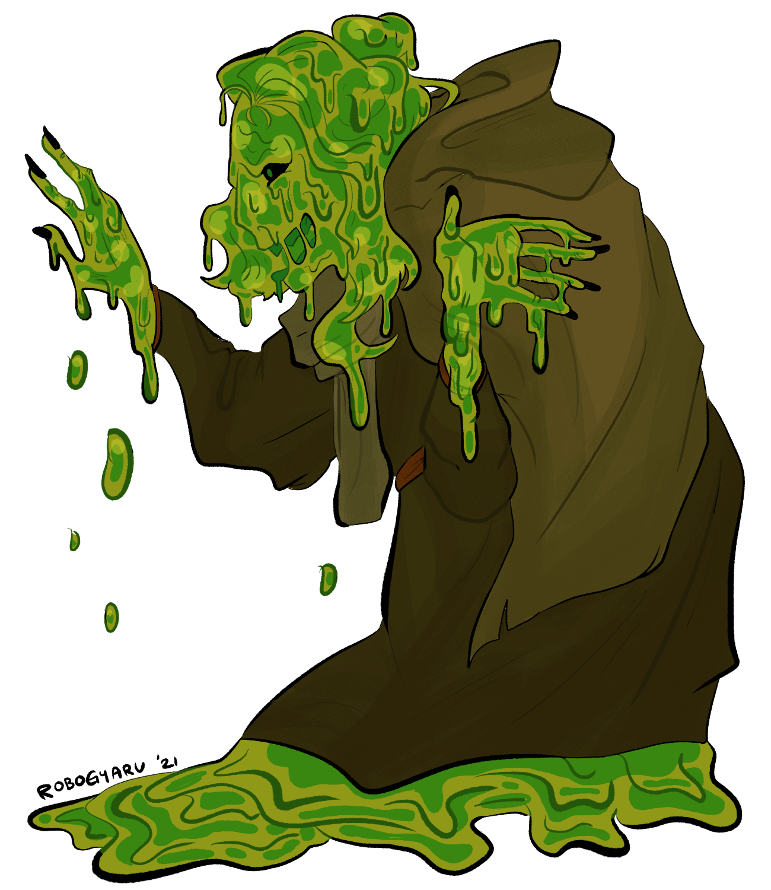

# October 6th, 2021 (Challenge 5)

Prompt: **Ooze**

### [Snot Hag](https://github.com/mpanighetti/dnd5e-monsters/blob/main/oozes/snot-hag.md)

#### Description

Long ago, an enterprising hag whose name has been lost to time sought to experiment on the spawn of Juiblex in order to create farms of easily reproducible loyal subjects, so that she might be able to combine her power with her own creations rather than forming a more traditional coven dynamic with untrustworthy rival hags. This experiment was fruitful, but her celebration was short-lived, as the awakened ooze quickly consumed her body and began its own new line of succession. In this manner was the first snot hag born.

_**Amorphous Abominations.**_ A snot hag superficially resembles the approximate shape of an elderly humanoid woman, but one would be hard-pressed to confuse the two due to the former's oobleckian form. The hag's body jiggles and wavers, struggling to maintain a roughly bipedal appearance matching the creature's twisted self-image. The ooze will even wear some loose semblance of rags and pointed hats to attempt to convey the image.

_**Ooze Nature.**_ A snot hag doesn't require sleep.

_**Unique Reproduction.**_ Unlike more typical hag propagation, snot hags exclusively reproduce asexually through mitosis, without the need to consume an infant beforehand — though it wouldn't turn down such a treat for general sustenance.

<figure>
  
  <figcaption>Snot Hag by <a href="https://twitter.com/robogyaru">robogyaru</a></figcaption>
</figure>

#### Snot Hag Covens

In some senses, a snot hag has achieved an ideal state of growing in power, where it forms covens almost exclusively with its own spawn, achieving self-sufficiency and likemindedness, and avoiding the typical infighting seen in other covens. All snot hags desire only to learn, to grow, to consume, and to multiply. That said, a snot hag still has the innate "Rule of Three" burned into its psyche, and groups of snot hags will split into multiple covens and part ways to maintain this dynamic.

A snot hag that is part of a coven (see the "Hag Covens" sidebar in the _Monster Manual_) has a challenge rating of 7 (2,900 XP). The hag uses Constitution as its spellcasting ability when using the coven's Shared Spellcasting feature.

Snot hags will automatically form a coven with other snot hags formed from splitting. Covens with non-ooze hags are not impossible but tend to be short-lived; either the snot hag will consume its sister in an effort to absorb her powers, or the other hag will destroy the slime in a backstabbing effort to rid the world of an aberration that threatens the livelihood of all hags.

#### Snot Hag Lairs

Snot hags tend to be drawn to damp environments when forming their lairs. These can include swamps, sewers, or underground lakes within deep caverns, but any area with suitable humidity might be considered.

##### Lair Actions

In addition to the hag lair actions in _Volo's Guide to Monsters_, a powerful snot hag might have the following additional lair action:

- The snot hag creates a spray of slime in a 30-foot radius sphere centered on the hag. The slime dissipates on initiative count 20 on the next round. The slime creates difficult terrain for all creatures except oozes, which instead double their speed while moving through the slime.

##### Regional Effects

In addition to the hag lair regional effects in _Volo's Guide to Monsters_, a powerful snot hag creates one or more of the following additional regional effects within 1 mile of its lair:

- Showers of acid rain intermittently pour down. Creatures traveling during an acid rainstorm take 2d4 acid damage per hour of exposure. The rain also prevents gaining the benefits of a short or long rest unless creatures can cover themselves.
- All bodies of water have a 25% chance of being unsafe to drink. Creatures attempting to drink this water must succeed on a DC 13 Constitution saving throw or be poisoned for 1 hour.

#### Attributes

_Medium ooze, unaligned_

- **Armor Class** 8
- **Hit Points** 136 (16d8 + 64)
- **Speed** 20 ft., climb 20 ft.

|  STR  |  DEX  |  CON  |  INT  |  WIS  | CHA  |
|:-----:|:-----:|:-----:|:-----:|:-----:|:----:|
|18 (+4)|6 (-2) |18 (+4)|10 (+0)|13 (+1)|1 (-5)|

- **Saving Throws** CON +7
- **Immunities** Acid, Blinded, Charmed, Cold, Deafened, Exhausted, Frightened, Lightning, Prone, Slashing
- **Senses** Blindsight 60 ft. (blind beyond this radius), passive Perception 11
- **Languages** Common, Sylvan
- **Challenge** 5 (1,800 XP) **Proficiency Bonus** +3

#### Traits

_**Amorphous.**_ The hag can move through a space as narrow as 1 inch wide without squeezing.

_**Innate Spellcasting.**_ The hag's innate spellcasting ability is Constitution (spell save DC 15, +7 to hit with spell attacks). It can innately cast the following spells, requiring no components:

- At will: _minor illusion_
- 3/day each: _color spray_, _hold person_ (as 3rd-level spell)

_**Spider Climb.**_ The hag can climb difficult surfaces, including upside-down on ceilings, without needing to make an ability check.

#### Actions

_**Pseudopod.**_ _Melee Weapon Attack:_ +7 to hit, reach 5 ft., one target. _Hit:_ 7 (1d6 + 4) Bludgeoning damage plus 18 (4d8) Acid damage.

_**Engulf.**_ The snot hag moves up to its speed. While doing so, it can enter the space of a creature the same size or smaller than the hag. Whenever the hag enters such a creature's space, the creature must make a DC 14 Dexterity Saving Throw.

On a successful Saving Throw, the creature can choose to be pushed 5 feet back or to the side of the hag. A creature that chooses not to be pushed or that doesn't have room to be pushed suffers the consequences of a failed Saving Throw.

On a failed Saving Throw, the hag enters the creature's space, and the creature takes 13 (3d8) Acid damage and is engulfed. The engulfed creature can't breathe, they are Restrained, and they take 27 (6d8) Acid damage at the start of each of the hag's turns. When the hag moves, the engulfed creature moves with it. The hag can have one Medium creature, two Small creatures, or four Tiny creatures engulfed at a time.

An engulfed creature can try to escape by taking an Action to make a DC 14 Strength check. On a success, the creature escapes and enters a space of their choice within 5 feet of the hag.

#### Reactions

_**Gut Reaction.**_ When the snot hag is forced to make an Intelligence, Wisdom, or Charisma Saving Throw, it can choose to make a Constitution Saving Throw of the same DC instead.

_**Split.**_ When a snot hag that is Medium or larger is subjected to Lightning or Slashing damage, it splits into two new snot hags if it has at least 10 hit points. Each new hag has hit points equal to half the original hag's, rounded down. New hags are one size smaller than the original hag, but will grow by one size every 24 hours until reaching Medium size.

The snot hag cannot use this reaction if it is already part of a coven of three hags.

---

| ⬅️ [October 5th: Parasite](2021-10-05-parasite.md) | [October 7th: The Deep](2021-10-07-the-deep.md) ➡️ |
|:-|-:|
