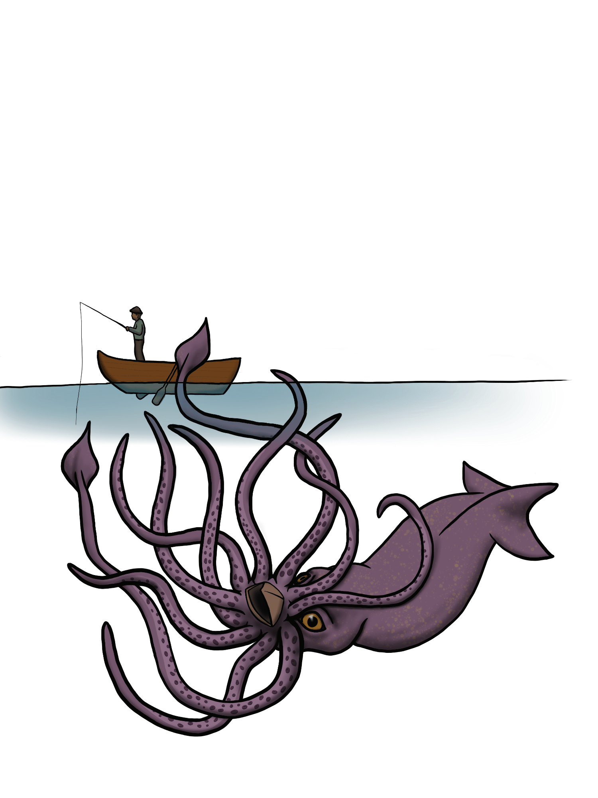

# October 7th, 2021 (Challenge 6)

Prompt: **The Deep**

### [Giant Squid](https://github.com/mpanighetti/dnd5e-monsters/blob/main/beasts/giant-squid.md)

#### Description

Giant squid are massive cephalopods found in the deepest oceans. Their remote habitat makes scholarly studies difficult, and most observations have been of dead specimen remains found floating on the water's surface. Even these findings have revealed important details, such as upper bounds on their size — at least 40 feet from mantle to the ends of their tentacles.

These creatures primarily feed on deep-sea fish and smaller squid species. They are territorial, fending off their waters even from other giant squid, engaging in vicious battles to maintain their domains. They mostly reside at the top of the food chain of deeper waters, having to only fear predation from sperm whales, kraken, and other such leviathans. Rare surface sightings are sometimes confused for krakens, but giant squid tend to be much less aggressive toward surface-dwellers, and have only occasionally been known to attack ships or swimmers when hunger sufficiently compels them to leave their territories.

<figure>
  
  <figcaption>Giant Squid by <a href="https://tigerlilynoh.tumblr.com/">TigerLilyNoh</a></figcaption>
</figure>

#### Attributes

_Gargantuan Beast, Unaligned_

**AC** 15 **Initiative** +6 (16)

**HP** 186 (12d20 + 60)

**Speed** 0 ft., Swim 60 ft.

|       |   | MOD | SAVE |       |   | MOD | SAVE |
|:-----:|:-:|:---:|:----:|:-----:|:-:|:---:|:----:|
|**STR**|18 | +4  |  +4  |**INT**| 7 | -1  |  -1  |
|**DEX**|22 | +6  |  +9  |**WIS**|16 | +3  |  +3  |
|**CON**|20 | +5  |  +8  |**CHA**| 4 | -3  |  -3  |

**Skills** Athletics +7, Perception +9, Stealth +9

**Resistances** Cold

**Senses** Darkvision 120 ft., Passive Perception 19

**Languages** None

**CR** 6 (XP 2,300; PB +3)

#### Traits

_**Siege Monster.**_ The squid deals double damage to objects and structures.

_**Water Breathing.**_ The squid can breathe only underwater.

#### Actions

_**Multiattack.**_ The squid makes one Bite attack and two Tentacle attacks.

_**Bite.** Melee Attack Roll:_ +7 to hit, reach 5 ft., one target. _Hit:_ 17 (3d8 + 4) Piercing damage.

_**Tentacles.** Melee Attack Roll:_ +9 to hit, reach 20 ft. _Hit:_ 16 (3d6 + 6) Bludgeoning damage. If the target is a creature, it the Grappled condition (escape DC 17). While Grappled, the target has the Restrained condition. The squid has two tentacles available for this action, each of which can't be used on other targets while it is grappling a creature.

#### Reactions

_**Ink Cloud (1/Rest).** Trigger:_ A creature ends its turn within 10 feet of the squid while underwater. _Response:_ The squid releases ink that fills a 40-foot Radius Sphere centered on itself, and the squid moves up to its Swim Speed. The Sphere is Heavily Obscured for 10 minutes or until a strong current or similar effect disperses the ink.

---

| ⬅️ [October 6th: Ooze](2021-10-06-ooze.md) | [October 8th: Psychopomp](2021-10-08-psychopomp.md) ➡️ |
|:-|-:|
