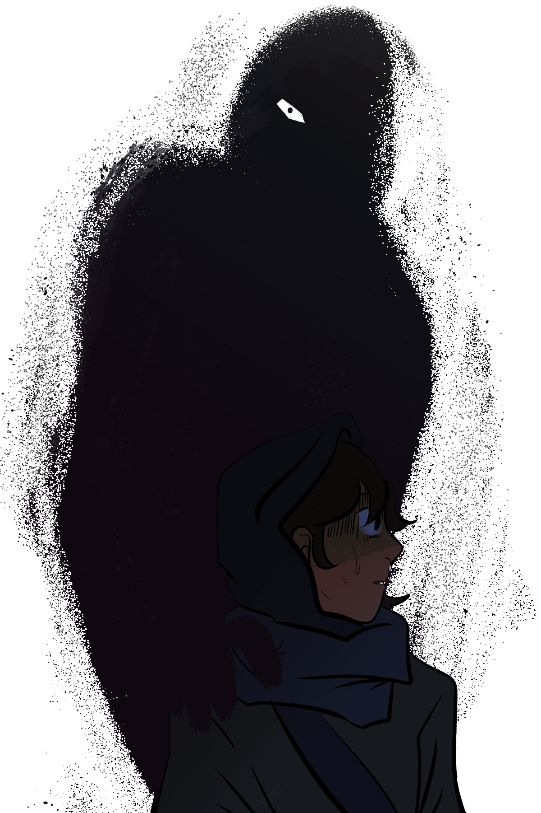

# October 8th, 2021 (Challenge 7)

Prompt: **Psychopomp**

### False Shadow

#### Description

There is a superstition that the shadow of one fated for a premature death will start to move independently of their body. The truth is at once more straightforward and more disturbing: their shadow could have been consumed by a false shadow, which then is attempting to more directly orchestrate their demise.

A false shadow is an amorphous being drawn toward vibrations in the cosmic strings that tie individuals to their greater fates in life. These creatures seek to cut those strings, gaining sustenance from the lost potential in the fates of mighty heroes and important historical figures. By devouring these figures' shadows, they gain the ability to tug on the severed strands of destiny like a puppeteer and guide their captives toward death and ruin. This could manifest as subtle adjustments in their lives and decision-making, like turning down a job offer or courting one person over another, or more severe, such as a mistimed swing of a sword in deadly combat.

While not obscured by darkness or impersonating shadows, a false shadow looks like a normal shadow, but in a shifting form and detached from any object that might be casting such a shape. It thus makes all efforts to avoid this discernible state, jumping out of the light while it seeks out its targets.

<figure>
  
  <figcaption>False Shadow by <a href="https://twitter.com/robogyaru">robogyaru</a></figcaption>
</figure>

#### Attributes

_Medium Aberration, Lawful Evil_

**AC** 15 **Initiative** +3 (13)

**HP** 85 (10d8 + 40)

**Speed** 30 ft.

|       |   | MOD | SAVE |   |       | MOD | SAVE |
|:-----:|:-:|:---:|:----:|:-----:|:-:|:---:|:----:|
|**STR**| 2 | -4  |  -4  |**INT**|20 | +5  |  +5  |
|**DEX**|17 | +3  |  +3  |**WIS**|18 | +4  |  +4  |
|**CON**|19 | +4  |  +4  |**CHA**|12 | +1  |  +1  |

**Skills** Deception +4, Stealth +9

**Resistances** Bludgeoning, Piercing, Psychic, Slashing

**Immunities** Charmed, Exhausted, Frightened, Grappled, Paralyzed, Petrified, Poison, Prone, Restrained

**Senses** Darkvision 60 ft., Passive Perception 14

**Languages** understands the languages of a creature attached to it but cannot speak

**CR** 7 (XP 2,900; PB +3)

#### Traits

_**Damage Transfer.**_ While it is attached to a creature using its Attach action, the false shadow takes only half of any damage dealt to it, and the attached creature takes the other half.

_**Darkness Camouflage.**_ While the false shadow is in Dim Light or Darkness, it blends perfectly with any surrounding shadows not cast by a creature and has the Invisible condition.

_**Devil's Sight.**_ Magical Darkness doesn't impede the false shadow's Darkvision.

#### Actions

_**Attach.**_ The false shadow attaches to any creature that doesn't have a shadow, taking on the size, appearance, and behavior of the creature's original shadow. While attached to a creature, the false shadow shares the creature's space, it moves with the attached creature, and it cannot move independently. The _Remove Curse_ spell or similar magic targeting the attached creature or the false shadow detaches the two creatures, or the false shadow can willingly detach itself at any time.

_**Devour Shadow (Recharge 5-6).** Constitution Saving Throw:_ DC 15, reach 5 ft., one creature. The Saving Throw is made with Disadvantage if the creature cannot see the false shadow. _Failure:_ The creature's shadow is destroyed, at which point the false shadow immediately attaches to the creature using its Attach action. A creature's destroyed shadow can be restored using _Greater Restoration_ or similar spells, unless the false shadow is currently attached to the creature. _Success:_ The creature is immune to this false shadow's Devour Shadow for the next 24 hours.

_**Mind Assault.** Melee Attack Roll:_ +8 to hit, reach 0 ft., one creature attached to the false shadow using its Attach action. _Hit:_ 9 (2d8) Psychic damage, and the target's Hit Point Maximum is reduced by an amount equal to the damage taken. The target dies if this effect reduces its Hit Point Maximum to 0.

_**Puppet.** Wisdom Saving Throw:_ DC 15, one creature attached to the false shadow using its Attach action. _Failure:_ Until the end of the creature's next turn, its actions, bonus actions, reactions, and movement are controlled by the false shadow. The false shadow can only physically control the creature's body and cannot exert its will on the creature's speech or thoughts.

#### Bonus Actions

_**Shadow Slink.**_ While the false shadow is in Dim Light or Darkness, it moves up to half its Speed without provoking Opportunity Attack action. If the false shadow ends this movement in Dim Light or Datrkness, it can take the Hide action.

#### Reactions

_**Siphon Fortune.** Trigger:_ A creature attached to the false shadow using its Attach action succeeds on a d20 Test. _Response:_ The false shadow forces the creature to reroll the d20 and take the lower result. If this causes the creature to fail its d20 Test, the false shadow regains a number of Hit Points equal to the failed d20 Test result.

---

| ⬅️ [October 7th: The Deep](2021-10-07-the-deep.md) | [October 9th: Pumpkin Spice](2021-10-09-pumpkin-spice.md) ➡️ |
|:-|-:|
