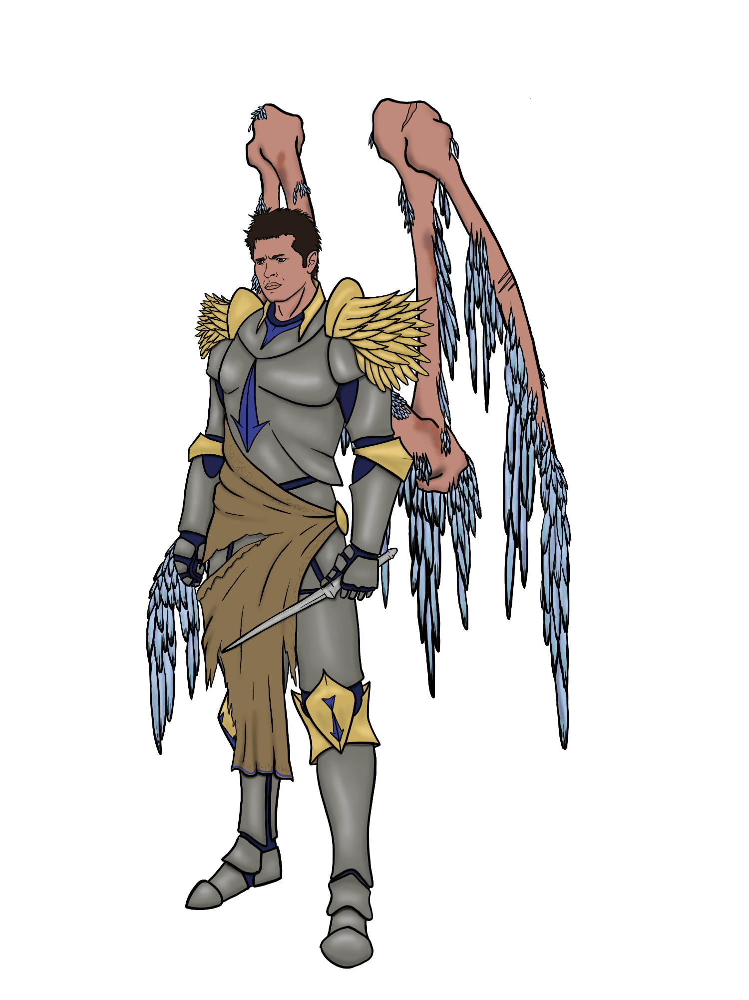

# October 10th, 2021 (Challenge 9)

Prompt: **Supernatural**

### Fallen Angel

#### Description

Though an angelic being is generally honor-bound to the god it serves, on occasion one will question its orders and potentially defy them. An angel that falls in this manner loses some of its connection to its deity's divine grace.

Perhaps the most famous fallen angel is Zariel, who made a deal with Asmodeus to become an archdevil and rule over Avernus. But the act of falling does not guarantee succumbing to a path of of evil. Fallen angels, perhaps even more than before they fell, have a freedom to determine their own fates, and most often take on an indifferent stance in terms of the Blood War or the affairs of Mount Celestia. Whatever compelled the angel to fall might drive it to maintain its independence and autonomy.

Even after falling from grace, an angel will typically retain ownership of its angel blade, a powerful weapon designed to pierce evil hearts. It is perhaps a slight oversight of the blade's creators that it is equally effective against other angels, and that this power persists even in the hands of mortals. A rare person that comes across an angel blade will find itself in possession of a mighty power to wield against any foe.

#### Angel Blade

_Weapon (Longsword), Rare, Requires Attunement_

These silvery blades are standard issue for all frontline celestial soldiers in a god's army. They are similar in appearance to a mortal sword, but have been blessed with holy energies to effectively smite unbelievers.

You gain a +2 bonus to attack and damage rolls made with this weapon. When you hit a Celestial, Fiend, or evil-aligned creature with the Angel Blade, the attack is a Critical Hit and ignores Resistance for all damage dealt as part of the attack.

<figure>
  
  <figcaption>Fallen Angel by <a href="https://tigerlilynoh.tumblr.com/">TigerLilyNoh</a></figcaption>
</figure>

#### Attributes

_Medium Celestial, Chaotic Good_

**AC** 16 **Initiative** +4 (14)

**HP** 142 (15d8 + 75)

**Speed** 30 ft., fly 40 ft.

|       |   | MOD | SAVE |       |   | MOD | SAVE |
|:-----:|:-:|:---:|:----:|:-----:|:-:|:---:|:----:|
|**STR**|18 | +4  |  +8  |**INT**|14 | +2  |  +2  |
|**DEX**|18 | +4  |  +4  |**WIS**|18 | +4  |  +8  |
|**CON**|20 | +5  |  +5  |**CHA**|13 | +1  |  +1  |

**Skills** Deception +5, Insight +6, Perception +8

**Gear** Angel Blade

**Resistances** Bludgeoning, Piercing, Radiant, Slashing

**Immunities** Exhaustion, Frightened

**Senses** Darkvision 60 ft., Passive Perception 18

**Languages** all, telepathy 120 ft. with other celestial creatures

**CR** 9 (5,000 XP; PB +4)

#### Traits

_**Corrupted Grace.**_ The angel’s weapon attacks are magical. When the angel hits with any weapon, the weapon deals an extra 9 (2d8) necrotic damage.

_**Innate Spellcasting.**_ The angel’s innate spellcasting ability is Wisdom (spell save DC 16). The angel can innately cast the following spells, requiring only verbal components:

At will: _bane_, _detect evil and good_

3/day each: _misty step_

1/day each: _blinding smite_, _raise dead_, _searing smite_, _thunderous smite_

_**Magic Resistance.**_ The angel has advantage on saving throws against spells and other magical effects.

#### Actions

_**Multiattack.**_ The angel makes up to three melee attacks.

_**Angel Blade.**_ _Melee Attack Roll:_ +10 to hit, reach 5 ft.. _Hit:_ 10 (1d8 + 6) Slashing damage, or 11 (1d10 + 6) Slashing damage if used two-handed. When the angel blade hits a Celestial, Fiend, or evil-aligned creature, the attack is a Critical Hit and ignores Resistance for all damage dealt as part of the attack.

_**Healing Touch (3/Day).**_ The angel touches another creature. The target magically regains 14 (3d8 + 1) Hit Points and is freed from any curse, poison, blindness, or deafness.

---

| ⬅️ [October 9th: Pumpkin Spice](2021-10-09-pumpkin-spice.md) | [October 11th: Beast](2021-10-11-beast.md) ➡️ |
|:-|-:|
