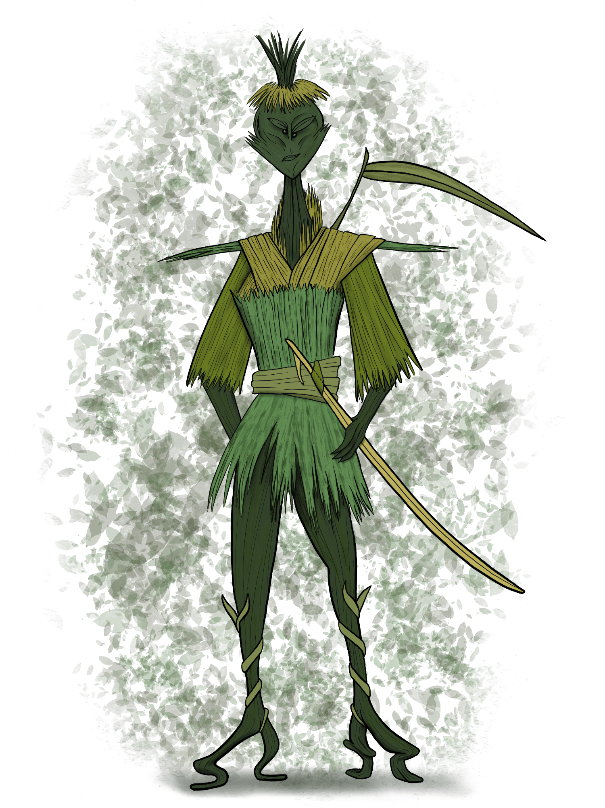

# October 19th, 2021 (Challenge 18)

Prompt: **Doppelgänger**

### Grass Warrior

#### Description

Crafted by a reclusive mage obsessed with puns, the Blade of Grass is a powerful magic weapon without equal, capable of slicing through foes as if made of the hardest steel. But the mage infused within the fibers of this sword a deep craving for lethal combat, and the sword imparts this desire on its wielder. If held by a warrior who cannot keep up with its bloodlust, the weapon saps life energy from its owner instead, draining them until they have nothing left to give. At that moment, the blade destroys the body and crafts a replacement of grass and straw, creating a grass warrior.

Even in death, this hollow reflection of the weapon's wielder is not allowed rest, and the warrior spends all its waking hours seeking out worthy opponents in one-on-one duels, as the Blade of Grass wishes to find a capable warrior who will carry it forward to future glory in battle. Once it finds someone capable of defeating its former owner, it transfers to the victor and the cycle begins anew.

#### Blade of Grass

_Weapon (Longsword), Legendary, Requires Attunement_

This magic weapon appears at first glance to be a large grass blade, but when wielded by a capable warrior, it whips into a straight edge and becomes razor-sharp. You gain a +3 bonus to attack and damage rolls made with the Blade of Grass, and all damage dealt as part of an attack with this weapon ignores damage resistance. Any attack roll made with the Blade of Grass is a critical hit on a roll of 19 or 20 on the d20. Druids are automatically proficient with this weapon.

As a Bonus Action, the sword can be mentally commanded to retract into a green grass cuff on your wrist, flatten and hide under any clothing on your arm or torso, or extend out into a blade in your hand again.

Once per day, you can cast _Ensnare_ through the Blade of Grass, requiring no Concentration (spell save DC 17).

**Curse.** The Blade of Grass is cursed, a fact that is revealed only when you attune to it. Attuning to the Blade of Grass curses you until you are targeted by the _remove curse_ spell or similar magic. While cursed, the Blade of Grass attaches itself to your dominant limb and cannot be removed from your body without severing the limb (this ends the curse), and if the sword has not been used to kill at least one creature in the last day, you suffer one level of exhaustion. Exhaustion suffered by the Blade of Grass can only be removed by removing the curse or by killing another creature with this blade (removes one level of exhaustion per creature killed). If you die while under this curse, your body is consumed by the Blade of Grass, transforming the corpse into a new Grass Warrior controlled by the Dungeon Master. This Grass Warrior retains your memories and assumes your physical appearance.

<figure>
  
  <figcaption>Grass Warrior by <a href="https://tigerlilynoh.tumblr.com/">TigerLilyNoh</a></figcaption>
</figure>

#### Attributes

_Medium Plant, Chaotic Evil_

**AC** 17 **Initiative** +3 (13)

**HP** 315 (30d8 + 180)

**Speed** 30 ft.

|       |   | MOD | SAVE |       |   | MOD | SAVE |
|:-----:|:-:|:---:|:----:|:-----:|:-:|:---:|:----:|
|**STR**|15 | +2  |  +2  |**INT**|12 | +1  |  +1  |
|**DEX**|16 | +3  |  +9  |**WIS**|18 | +4  |  +10 |
|**CON**|22 | +6  |  +12 |**CHA**| 8 | -1  |  -1  |

**Skills** Athletics +8, Deception +5, Stealth +9

**Gear** Blade of Grass

**Resistances** Bludgeoning, Piercing

**Immunities** Blinded, Deafened, Paralyzed

**Vulnerabilities** Fire, Slashing

**Senses** Tremorsense 30 ft., Passive Perception 14

**Languages** understands Common but can't speak

**CR** 18 (20,000 XP; PB +6)

#### Traits

_**Evasion.**_ If the grass warrior is subjected to an effect that allows it to make a Dexterity saving throw to take only half damage, the warrior instead takes no damage if it succeeds on the saving throw, and only half damage if it fails.

_**False Appearance.**_ While the grass warrior remains prone and motionless, it is indistinguishable from any surrounding grass and plant growth.

_**Magic Resistance.**_ The grass warrior has advantage on saving throws against spells and other magical effects.

_**Magic Weapons.**_ The grass warrior’s weapon attacks are magical.

#### Actions

_**Multiattack.**_ The grass warrior makes three attacks with the Blade of Grass.

_**Blade of Grass.**_ _Melee Attack Roll:_ +11 to hit, reach 5 ft.. _Hit:_ 14 (2d8 + 5) slashing damage, or 16 (2d10 + 5) slashing damage if held with two hands. All damage dealt as part of an attack with the Blade of Grass ignores damage resistance. Any attack roll made with the Blade of Grass is a critical hit on a roll of 19 or 20 on the d20.

_**Entangle (3/Day).**_ The grass warrior magically compels plants to ensnare a target of its choice within 10 feet. The target must succeed on a DC 19 Dexterity saving throw or become grappled and restrained (escape DC 19). The entangling plant growth has AC 10, 10 hit points, and is vulnerable to fire and slashing damage.

#### Reactions

_**Parry.**_ The grass warrior adds 2 to its AC against one melee attack that would hit it. To do so, the warrior must see the attacker.

---

| ⬅️ [October 18th: Boss Monster](2021-10-18-boss-monster.md) | [October 20th: Expanse](2021-10-20-expanse.md) ➡️ |
|:-|-:|
