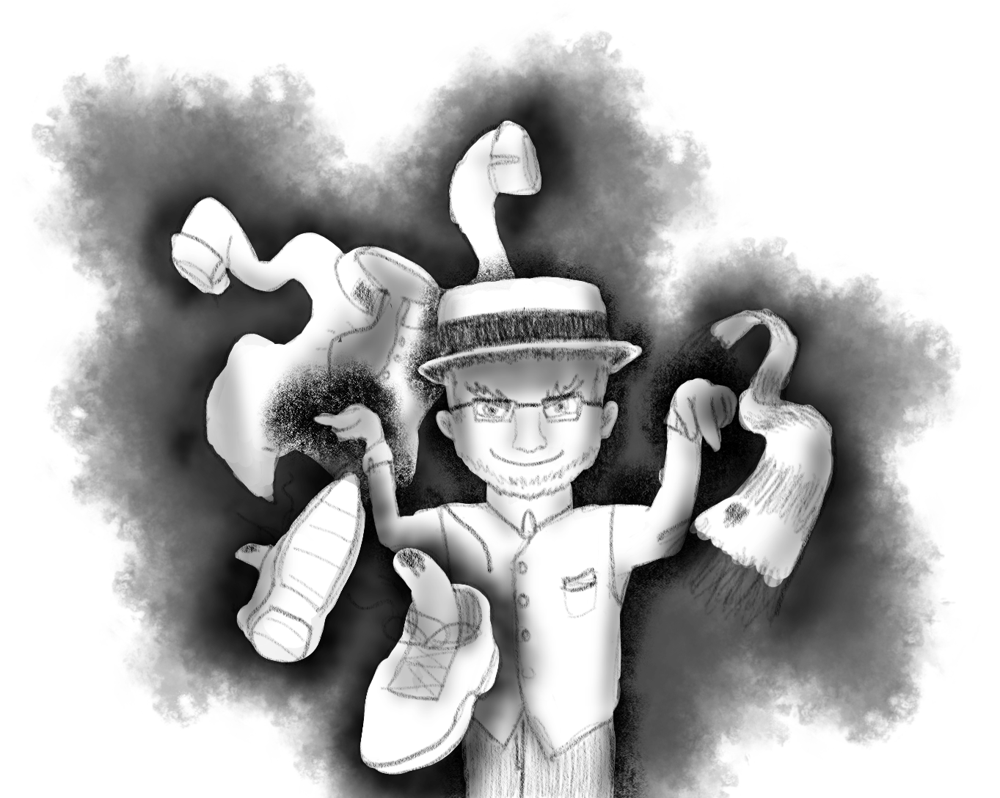

# October 12th (Challenge 11)

Prompt: **Accursed**

### [Galos the Clothier](https://github.com/mpanighetti/dnd5e-monsters/blob/main/humanoids/galos-the-clothier.md)

#### Lore

The latest of many generations of tailors, Galos made an honest living repairing and selling fine clothing for the nobility of Bridgeport. But when a competing tailor started to take his normal business, jealousy got the best of him and he sought to sabotage his foe. He forged a pact with a devil at the crossroads, and the fiend imbued Galos' blood with the ability to enthrall his enemies. This gift was triggered if Galos spilt his own blood over any article of clothing; the blood would merge into the fabrics, and anyone who wore the cursed articles would find themself under his direct psychic control.

Galos' sabotage was an immediate success. After tainting the competition's clothing, he compelled the unfortunate customers to go into a blind rage, lashing out against friends and loved ones, rioting, and ultimately taking their own lives. The other tailor was ruined and run out of town, and Galos enjoyed the sudden upturn in his business. But the wicked clothier was not satisfied by this single act of treachery, and soon he extended his influence further still.

He began ensorcelling his own customers, starting with small acts of treachery like increasing the payout of their purchases with overly generous tips, then using his power over them to force the revelation of trade secrets, and eventually currying favor with the city's district mayors to increase the spread of his own business. The blood of Galos spread across the linens of the entire city, and it seemed that none could escape his avaricious grasp.

Rumor eventually spread of a strange influence overtaking Bridgeport, and such rumors inevitably bring sellswords and brigands seeking to gain profit by ridding the city of its mysterious dark thrall. By the time they arrived, the entire citizenry was under Galos' mental compulsion to protect his wellbeing and to sell his tainted clothing to travelers. Most of the adventurers were quickly tricked into donning his fey apparel and joining his throng, while others were fought off by clothing Galos had animated to act as a line of defense. Were it not for the quick action of those who escaped this trickery, Galos' reign might have gone on unimpeded for years, but eventually he was taken down and the free will of the people restored.

In death, Galos' corrupted soul was condemned to serve the devils in the Blood War, but even in this fiendish state, he continues to carry out his enthralling through his enchanted blood and his skill with tailoring.

<figure>
  
  <figcaption>Galos the Clothier by <a href="https://mario.panighetti.net">Mario Panighetti</a></figcaption>
</figure>

#### Attributes

_Medium humanoid (human), neutral evil_

- **Armor Class** 17 (studded leather)
- **Hit Points** 230 (20d8 + 140)
- **Speed** 30 ft.

|  STR  |  DEX  |  CON  |  INT  |  WIS  |  CHA  |
|:-----:|:-----:|:-----:|:-----:|:-----:|:-----:|
|15 (+2)|20 (+5)|24 (+7)|15 (+2)|16 (+3)|21 (+5)|

- **Saving Throws** DEX +9, INT +6
- **Skills** Deception +9, Insight +7, Persuasion +9, Sleight of Hand +9
- **Resistances** Fire; Bludgeoning, Piercing, and Slashing from nonmagical attacks
- **Senses** darkvision 60 ft., passive Perception 13
- **Languages** Common, Infernal
- **Challenge** 11 (7,200 XP) **Proficiency Bonus** +4

#### Special traits

_**Spellcasting.**_ Galos is an 18th-level spellcaster. His spellcasting ability is Charisma (spell save DC 17, +9 to hit with spell attacks). Instead of spell slots, each time he casts a spell at 1st level or higher, he substitutes his own blood for any material components and deals himself 2 (1d4) piercing damage. He knows the following warlock spells:

- Cantrips (at will): _fire bolt_, _mind sliver_, _minor illusion_, _toll the dead_
- 1st-5th level (cast at 5th level): _counterspell_, _danse macabre_, _disguise self_, _expeditious retreat_, _fear_, _hellish rebuke_, _hex_, _hold monster_, _mind spike_, _negative energy flood_, _scorching ray_, _scrying_, _suggestion_, _wall of fire_
- 6th-9th level (1/long rest each): _forcecage_, _power word stun_, _psychic scream_, _Tasha's otherworldly guise_ (Lower Planes only)

_**Magic Resistance.**_ Galos has advantage on saving throws against spells and other magical effects.

_**Psychic Thrall.**_ Galos can communicate telepathically with any creature charmed by his Blood Thrall. As long as Galos is not unconscious, he can issue commands to creatures under his control at any time (no action required).

#### Actions

_**Multiattack.**_ Galos makes two rapier attacks.

_**Rapier.**_ _Melee Weapon Attack:_ +9 to hit, reach 5 ft., one target. _Hit:_ 9 (1d8 + 5) piercing damage.

_**Blood Curse.**_ Galos spills his own blood on an article of clothing in his possession, dealing himself 2 (1d4) piercing damage and causing one of the following effects of his choice:

- _Blood Animation._ The clothing becomes animated and under his control. Clothing animated in this manner uses an appropriate _animated object_ stat block.
- _Blood Thrall._ The clothing becomes cursed. While cursed in this manner, for every hour a creature wears the clothing, it must succeed on a DC 18 Wisdom saving throw or become charmed by Galos.

  While charmed in this manner: a creature sees Galos as an ally; it desires to wear the cursed clothing at all times and resists all efforts for it to be removed; it automatically fails all saving throws to resist a spell cast by Galos; and it is compelled to protect him and carry out his wishes at all costs, including self-sacrifice.

  This charm effect lasts until the cursed clothing is removed, until the curse is removed from the clothing, or until Galos dies or is on another plane of existence.

### Animated Clothing

When Galos uses his blood curse to animate an article of clothing, you can either pick a similar article of clothing using the _animated object_ stat blocks in the _Monster Manual_, or pick from one of the following new animated clothing stat blocks.

_**Constructed Nature.**_ Animated clothing does not require air, food, drink, or sleep.

### [Animated Pair of Boots](https://github.com/mpanighetti/dnd5e-monsters/blob/main/constructs/animated-pair-of-boots.md)

#### Attributes

_Pair of Tiny constructs, unaligned_

- **Armor Class** 14
- **Hit Points** 22 (5d8)
- **Speed** 30 ft.

|  STR  |  DEX  |  CON  | INT  | WIS  | CHA  |
|:-----:|:-----:|:-----:|:----:|:----:|:----:|
|10 (+0)|18 (+4)|11 (+0)|1 (-5)|3 (-4)|1 (-5)|

- **Immunities** Blinded, Charmed, Deafened, Frightened, Paralyzed, Petrified, Poisoned, Psychic
- **Senses** Blindsight 60 ft. (blind beyond this radius), passive Perception 6
- **Languages** —
- **Challenge** ½ (100 XP) **Proficiency Bonus** +2

#### Special traits

_**Antimagic Susceptibility.**_ The pair of boots is incapacitated while in the area of an antimagic field. If targeted by _dispel magic_, the boots must succeed on a Constitution saving throw against the caster’s spell save DC or fall unconscious for 1 minute.

_**Damage Transfer.**_ While worn by a creature, the pair of boots take only half the damage dealt to them, and the creature wearing the boots takes the other half.

_**Matching Pair.**_ The pair of boots fall unconscious if they are more than 40 feet apart from each other, and they remain unconscious until reunited. If they are 40 feet apart or closer and are not prevented from moving freely, as a bonus action, the boots can reunite in any unoccupied space between their two spaces. The boots can't take their Lace Up action unless they are united in the same space.

_**False Appearance.**_ While the pair of boots remains motionless, it is indistinguishable from a normal pair of boots.

#### Actions

_**Lace Up.**_ _Melee Weapon Attack:_ +6 to hit, reach 5 ft., one Medium or Small creature. _Hit:_ The pair of boots don themselves on the creature's feet, replacing any current footwear. While the boots are worn, the creature is grappled (escape DC 14), and the boots can't lace up another creature. Until this grapple ends, the target's movement is controlled by the boots. The boots can move a grappled creature up to the boots' full movement speed. The boots can doff themselves as a bonus action.

#### Reactions

_**Trip.**_ While worn, the pair of boots can force the creature wearing them to reroll a successful attack roll, skill check, or saving throw, and the creature must take the lower result.

### [Animated Corset](https://github.com/mpanighetti/dnd5e-monsters/blob/main/constructs/animated-corset.md)

#### Attributes

_Medium construct, unaligned_

- **Armor Class** 10
- **Hit Points** 27 (6d8)
- **Speed** 0 ft., fly 20 ft. (hover)

|  STR  |  DEX  |  CON  | INT  | WIS  | CHA  |
|:-----:|:-----:|:-----:|:----:|:----:|:----:|
|13 (+1)|15 (+2)|10 (+0)|1 (-5)|3 (-4)|1 (-5)|

- **Immunities** Blinded, Charmed, Deafened, Frightened, Paralyzed, Petrified, Poisoned, Psychic
- **Senses** Blindsight 60 ft. (blind beyond this radius), passive Perception 6
- **Languages** —
- **Challenge** 1 (200 XP) **Proficiency Bonus** +2

#### Special traits

_**Antimagic Susceptibility.**_ The corset is incapacitated while in the area of an antimagic field. If targeted by _dispel magic_, the corset must succeed on a Constitution saving throw against the caster’s spell save DC or fall unconscious for 1 minute.

_**Damage Transfer.**_ While worn by a creature, the corset takes only half the damage dealt to it, and the creature wearing the corset takes the other half.

_**False Appearance.**_ While the corset remains motionless, it is indistinguishable from a normal corset.

#### Actions

_**Cinch.**_ _Melee Weapon Attack:_ +4 to hit, reach 5 ft., one Medium or Small creature. _Hit:_ The corset dons itself on the creature's body. While the corset is worn, the target's movement speed is halved, it is at risk of suffocating, and the corset can't cinch another target. In addition, at the start of each of the target's turns, the target takes 9 (1d6 + 2) bludgeoning damage. The target can attempt to doff the corset as if escaping from a grapple (escape DC 13), or the corset can doff itself as a bonus action.

### [Animated Pair of Gloves](https://github.com/mpanighetti/dnd5e-monsters/blob/main/constructs/animated-pair-of-gloves.md)

#### Attributes

_Pair of Tiny constructs, unaligned_

- **Armor Class** 14
- **Hit Points** 22 (5d8)
- **Speed** 5 ft., fly 20 ft. (hover)

|  STR  |  DEX  |  CON  | INT  | WIS  | CHA  |
|:-----:|:-----:|:-----:|:----:|:----:|:----:|
|16 (+3)|16 (+3)|10 (+0)|1 (-5)|3 (-4)|1 (-5)|

- **Immunities** Blinded, Charmed, Deafened, Frightened, Paralyzed, Petrified, Poisoned, Psychic
- **Senses** Blindsight 60 ft. (blind beyond this radius), passive Perception 6
- **Languages** —
- **Challenge** 1 (100 XP) **Proficiency Bonus** +2

#### Special traits

_**Antimagic Susceptibility.**_ The pair of gloves is incapacitated while in the area of an antimagic field. If targeted by _dispel magic_, the gloves must succeed on a Constitution saving throw against the caster’s spell save DC or fall unconscious for 1 minute.

_**Damage Transfer.**_ While worn by a creature, the pair of gloves take only half the damage dealt to them, and the creature wearing the gloves takes the other half.

_**Matching Pair.**_ The pair of gloves fall unconscious if they are more than 40 feet apart from each other, and they remain unconscious until reunited. If they are 40 feet apart or closer and are not prevented from moving freely, as a bonus action, the gloves can reunite in any unoccupied space between their two spaces. The gloves can't take their Slip On action unless they are united in the same space.

_**False Appearance.**_ While the pair of gloves remains motionless, it is indistinguishable from a normal pair of gloves.

#### Actions

_**Multiattack.**_ The pair of gloves makes two Stop Hitting Yourself attacks against the creature wearing them.

_**Slip On.**_ _Melee Weapon Attack:_ +5 to hit, reach 5 ft., one Medium or Small creature. _Hit:_ The pair of gloves don themselves on the creature's hands or appendages, replacing any current gloves. While the gloves are worn: any time the target attempts to make weapon attacks, interact with objects, or use somatic components for casting spells, it must first succeed on a contested Dexterity check against the gloves; and the gloves can't slip onto another creature. The target can attempt to doff the gloves as if escaping from a grapple (escape DC 14), or the gloves can doff themselves as a bonus action.

_**Stop Hitting Yourself.**_ The pair of gloves attempts to slap or punch the creature wearing them. The creature must succeed on a DC 14 Dexterity saving throw or take bludgeoning damage equal to the creature's own unarmed strike (minimum 1).

---

| ⬅️ [October 11th: Beast](october-11-beast.md) | [October 13th: B-Movie Monster](october-13-b-movie-monster.md) ➡️ |
|:-|-:|
