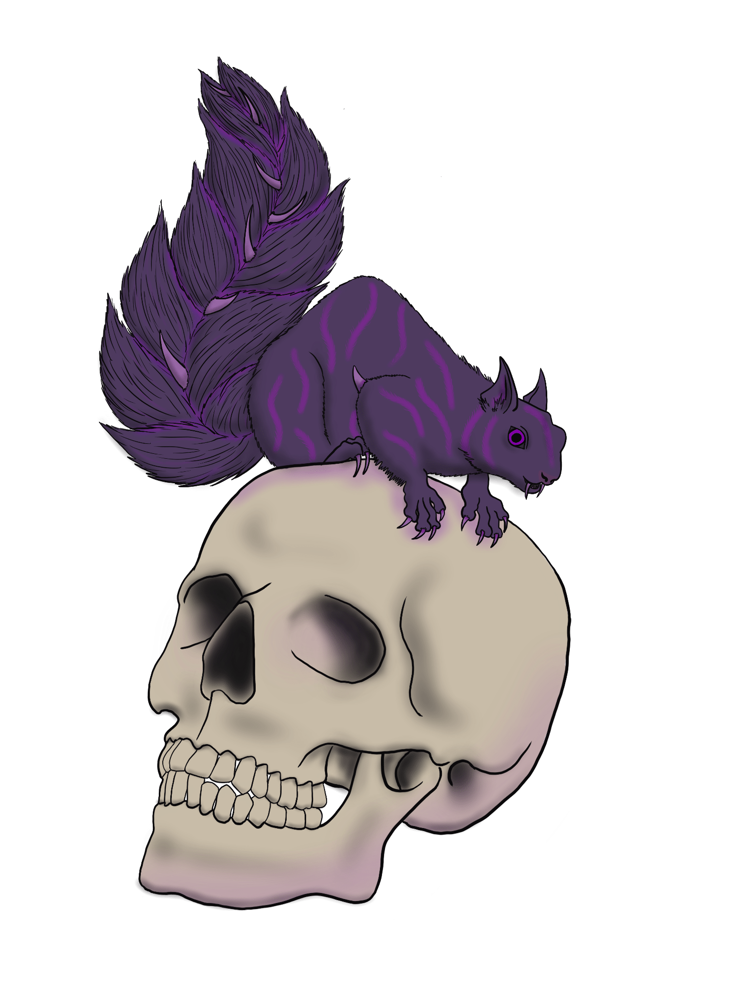
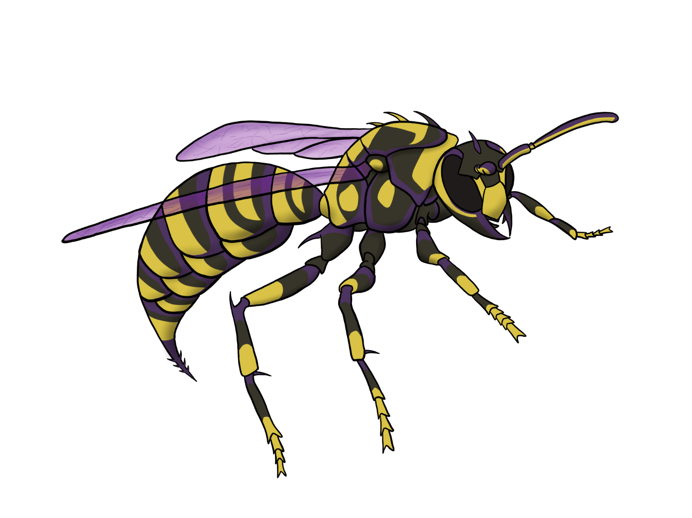
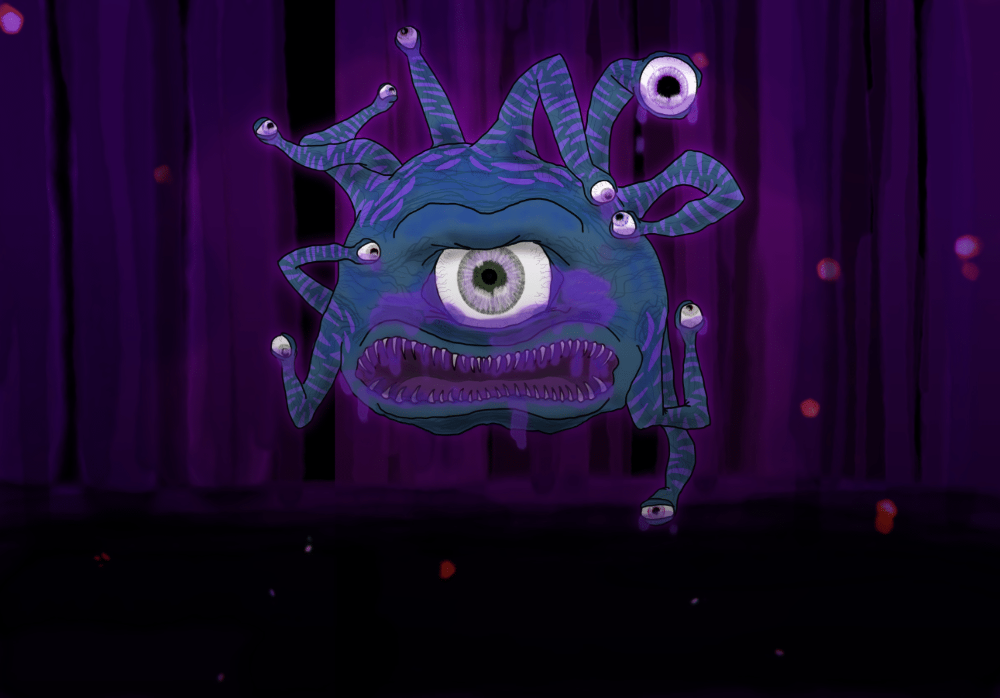

# October 14th (Challenge 13)

Prompt: **Forest**

## Creatures of the Murexian Grove

The peaks of the Ashen Scape loom large on the horizon, towering over the plains to the west and separating them from the seas. This mountain range was formed from now-dormant volcanoes as the continent drifted across shifting plates deep beneath the ocean. Though these mountains no longer rain down fiery death upon the lands, the soil was infused with vast deposits of a material known as murex, which gives the neighboring forest both its name and its purplish hue.

### Anatomy of a Murexian Creature

Murex exists at all levels of the food chain in the Grove, permeating from the soil to the plants to the herbivores and carnivores, then back into the soil and carrion feeders. Though murex is highly toxic when creatures are exposed to it directly, the denizens of the forest adapt to the murex and incorporate it into their bodies. In addition to the bright purple stripes, spots, rings, and other markings, the murex can cause more extreme mutations. Creatures corrupted by murex will become venomous, injecting deadly toxins into any prey that hasn't adapted to endure the effect.

On occasion, these mutations extend to new physiological features such as back and tail frills or bioluminescence. The intensity of the physical mutations increases with higher levels of corruption.

A plant or animal newly introduced to the Murexian Grove, if not killed and eaten by the deadly venomous predators there, will start to mutate after subsisting on a murexian diet for about one month. Most of the physical changes will last until the creature dies or is removed from the Grove for more than 1d4 days. Constructs and undead, as well as creatures that are already immune to Poison, are immune to murexian corruption.

### Murexian Corruption Levels

Murexian creatures have varying traits due to the severity of corruption caused by the murex in their systems. The following traits apply to all murexian creatures of given challenge rating thresholds; lower corruption traits also apply to creatures with more severe corruption, unless otherwise noted. In addition, creatures corrupted by murex gain the monstrosity type in addition to their current types.

#### Partial Corruption (Challenge 1 or lower)

_**Murexian Immunity.**_ The creature is immune to Poison, including murexian Poison.

_**Poisonous Skin.**_ If another creature comes into direct contact with a murexian creature's body, they must succeed on a DC 9 Constitution Saving Throw or become Poisoned for 1 minute. A Poisoned creature no longer in direct contact with the murexian creature can repeat the Saving Throw at the end of each of their turns, ending the effect on themself on a success.

Additionally, if a creature eats a murexian plant or animal, they must succeed on a DC 12 Constitution Saving Throw or become Poisoned for 1 hour.

#### Severe Corruption (Challenge 2-5)

_**Enhanced Poisonous Skin.**_ The DC on the Poisonous Skin trait's Saving Throw is now increased to the recommended level for the creature's challenge rating (after murexian corruption modifications). For example, a creature with challenge 2 has a recommended save DC of 13, and a creature with challenge 8 increases the save DC to 16. See the Dungeon Master's Workshop chapter in the _Dungeon Master's Guide_ for reference.

Additionally, a creature that fails this Saving Throw is paralyzed until the end of their next turn.

_**Murexian Poison.**_ All attacks and traits of a murexian creature that deal Poison damage or conditions treat Poison immunity as Poison resistance and ignores a target's normal Poison resistance, unless the target has specific resistances or immunities to murexian Poisons. Targets with Poison immunity or murexian Poison resistance have Advantage on Saving Throws against murexian Poison, and targets with murexian Poison immunity automatically succeed on such Saving Throws.

_**Toxic Injection.**_ The sludge coursing through the veins and fangs of murexian creatures is highly toxic to those who come in contact with them. When a murexian creature hits a creature with an attack using a natural weapon (e.g. a Bite or Claws attack), the attack deals an additional 1d6 murexian Poison damage.

#### Complete Corruption (Challenge 6 or higher)

_**Toxic Infusion.**_ The Toxic Injection trait deals an additional 3d6 murexian Poison damage on a hit with attacks using a natural weapon.

_**Venom Surge.**_ A creature that is already Poisoned by murex and fails the Poisonous Skin Saving Throw instead suffers one level of Exhaustion. A creature cannot have more than one level of Exhaustion at a time caused by the Venom Surge trait from the same murexian creature.

## Example Murexian Creatures

The following creatures are all based on existing creatures and modified with murexian traits based on their original challenge rating (the murexian squirrel is based on a rat with climbing speed and pack tactics added). This can serve as an example of how murex corruption affects a stat block. Note that the addition of Poison immunity, contact Poison effects, and increased damage on attacks can affect the challenge rating; an effort has been made to recalculate challenge ratings accordingly, and some attributes have been adjusted to better match the new challenge rating.

### [Murexian Squirrel](https://github.com/mpanighetti/dnd5e-monsters/blob/main/monstrosities/murexian-squirrel.md)

<figure>
  
  <figcaption>Murexian Squirrel by <a href="https://tigerlilynoh.tumblr.com">TigerLilyNoh</a></figcaption>
</figure>

#### Attributes

_Tiny beast/monstrosity, unaligned_

- **Armor Class** 10
- **Hit Points** 1 (1d4 - 1)
- **Speed** 20 ft., climb 30 ft.

| STR  |  DEX  | CON  | INT  |  WIS  | CHA  |
|:----:|:-----:|:----:|:----:|:-----:|:----:|
|2 (-4)|11 (+0)|9 (-1)|2 (-4)|10 (+0)|4 (-3)|

- **Immunities** Poison, murexian Poison
- **Senses** darkvision, passive Perception 10
- **Languages** —
- **Challenge** 0 (10 XP) **Proficiency Bonus** +2

#### Special Traits

_**Keen Smell.**_ The squirrel has advantage on Wisdom (Perception) checks that rely on smell.

_**Pack Tactics.**_ The squirrel has advantage on attack rolls against a creature if at least one of the squirrel's allies is within 5 feet of the creature and isn't incapacitated.

_**Poisonous Skin.**_ If another creature comes into direct contact with the squirrel's body (including as part of the squirrel's Bite attack), they must succeed on a DC 9 Constitution Saving Throw or become Poisoned with murex for 1 minute. A Poisoned creature no longer in direct contact with the squirrel can repeat the Saving Throw at the end of each of their turns, ending the effect on themself on a success.

#### Actions

_**Bite.**_ _Melee Weapon Attack:_ +0 to hit, reach 5 ft., one target. _Hit:_ 1 Piercing damage.

### [Murexian Twig Blight](https://github.com/mpanighetti/dnd5e-monsters/blob/main/monstrosities/murexian-twig-blight.md)

#### Attributes

_Small plant/monstrosity, neutral evil_

- **Armor Class** 13 (natural armor)
- **Hit Points** 4 (1d6 + 1)
- **Speed** 20 ft.

| STR  |  DEX  |  CON  | INT  | WIS  | CHA  |
|:----:|:-----:|:-----:|:----:|:----:|:----:|
|6 (-2)|13 (+1)|12 (+1)|4 (-3)|8 (-1)|3 (-4)|

- **Damage Vulnerabilities** fire
- **Immunities** Blinded, Deafened, Poison, murexian Poison
- **Senses** blindsight 60 ft. (blind beyond this radius), passive Perception 9
- **Languages** understands Common but can't speak
- **Challenge** ⅛ (25 XP) **Proficiency Bonus** +2

#### Special Traits

_**False Appearance.**_ While the blight remains motionless, they are indistinguishable from a dead shrub.

_**Poisonous Skin.**_ If another creature comes into direct contact with the twig blight's body (including as part of the twig blight's Claws attack), they must succeed on a DC 9 Constitution Saving Throw or become Poisoned with murex for 1 minute. A Poisoned creature no longer in direct contact with the squirrel can repeat the Saving Throw at the end of each of their turns, ending the effect on themself on a success.

#### Actions

_**Claws.**_ _Melee Weapon Attack:_ +3 to hit, reach 5 ft., one target. _Hit:_ 3 (1d4 + 1) Piercing damage.

### [Murexian Giant Boar](https://github.com/mpanighetti/dnd5e-monsters/blob/main/monstrosities/murexian-giant-boar.md)

#### Attributes

_Large beast/monstrosity, unaligned_

- **Armor Class** 12 (natural armor)
- **Hit Points** 42 (5d10 + 15)
- **Speed** 40 ft.

|  STR  |  DEX  |  CON  | INT  | WIS  | CHA  |
|:-----:|:-----:|:-----:|:----:|:----:|:----:|
|17 (+3)|10 (+0)|16 (+3)|2 (-4)|7 (-2)|5 (-3)|

- **Immunities** Poison, murexian Poison
- **Senses** passive Perception 8
- **Languages** —
- **Challenge** 2 (450 XP) **Proficiency Bonus** +2

#### Special Traits

_**Charge.**_ If the boar moves at least 20 feet straight toward a target and then hits them with a tusk attack on the same turn, the target takes an extra 7 (2d6) Slashing damage. If the target is a creature, they must succeed on a DC 13 Strength Saving Throw or be knocked Prone.

_**Murexian Poison.**_ All murexian Poison damage and conditions dealt by the boar treat Poison immunity as Poison resistance and ignore a target's normal Poison resistance, unless the target has specific resistance or immunity to murexian Poisons. Targets with Poison immunity or murexian Poison resistance have Advantage on Saving Throws against murexian Poison, and targets with murexian Poison immunity automatically succeed on such Saving Throws.

_**Enhanced Poisonous Skin.**_ If another creature comes into direct contact with the boar's body (including as part of the boar's Tusk attack), they must succeed on a DC 13 Constitution Saving Throw or become Poisoned with murex for 1 minute and Paralyzed until the end of their next turn. A Poisoned creature no longer in direct contact with the boar can repeat the Saving Throw at the end of each of their turns, ending the effect on themself on a success.

_**Relentless (Recharges after a Short or Long Rest).**_ If the boar takes 10 damage or less that would reduce them to 0 Hit Points, they are reduced to 1 Hit Point instead.

#### Actions

_**Tusk.**_ _Melee Weapon Attack:_ +5 to hit, reach 5 ft., one target. _Hit:_ 10 (2d6 + 3) Slashing damage plus 3 (1d6) murexian Poison damage.

### [Murexian Tyrannosaurus rex](https://github.com/mpanighetti/dnd5e-monsters/blob/main/monstrosities/murexian-tyrannosaurus-rex.md)

#### Attributes

_Huge beast/monstrosity, unaligned_

- **Armor Class** 15 (natural armor)
- **Hit Points** 149 (13d12 + 65)
- **Speed** 50 ft.

|  STR  |  DEX  |  CON  | INT  |  WIS  | CHA  |
|:-----:|:-----:|:-----:|:----:|:-----:|:----:|
|24 (+6)|10 (+0)|21 (+5)|2 (-4)|12 (+1)|9 (-1)|

- **Skills** Perception +4
- **Immunities** Poison, murexian Poison
- **Senses** passive Perception 14
- **Languages** —
- **Challenge** 10 (5,000 XP) **Proficiency Bonus** +4

#### Special Traits

_**Murexian Poison.**_ All murexian Poison damage and conditions dealt by T. rex treat Poison immunity as Poison resistance and ignore a target's normal Poison resistance, unless the target has specific resistance or immunity to murexian Poisons. Targets with Poison immunity or murexian Poison resistance have Advantage on Saving Throws against murexian Poison, and targets with murexian Poison immunity automatically succeed on such Saving Throws.

_**Venom Surge.**_ If another creature comes into direct contact with T. rex's body (including as part of T. rex's Bite or Tail attack), they must succeed on a DC 16 Constitution Saving Throw or become Poisoned with murex for 1 minute and Paralyzed until the end of their next turn. A Poisoned creature no longer in direct contact with T. rex can repeat the Saving Throw at the end of each of their turns, ending the effect on themself on a success.

Additionally, a creature that is already Poisoned by murex and fails this Saving Throw instead suffers one level of Exhaustion. A creature cannot have more than one level of Exhaustion at a time caused by the Venom Surge trait from the same murexian creature.

#### Actions

_**Multiattack.**_ T. rex makes two attacks: one with their bite and one with their tail. They can't make both attacks against the same target.

_**Bite.**_ _Melee Weapon Attack:_ +10 to hit, reach 10 ft., one target. _Hit:_ 32 (4d12 + 6) Piercing damage plus 14 (4d6) murexian Poison damage. If the target is a Medium or smaller creature, they are Grappled (escape DC 17). Until the Grappled condition ends, the target is Restrained, and T. rex can't bite another target.

_**Tail.**_ _Melee Weapon Attack:_ +10 to hit, reach 10 ft., one target. _Hit:_ 19 (3d8 + 6) Bludgeoning damage plus 14 (4d6) murexian Poison damage.

### [Murexian Hellwasp](https://github.com/mpanighetti/dnd5e-monsters/blob/main/monstrosities/murexian-hellwasp.md)

<figure>
  
  <figcaption>Murexian Hellwasp by <a href="https://tigerlilynoh.tumblr.com">TigerLilyNoh</a></figcaption>
</figure>

#### Attributes

_Large fiend/monstrosity, lawful evil_

- **Armor Class** 19 (natural armor)
- **Hit Points** 52 (8d10 + 8)
- **Speed** 10 ft., fly 60 ft. (hover)

|  STR  |  DEX  |  CON  |  INT  |  WIS  | CHA  |
|:-----:|:-----:|:-----:|:-----:|:-----:|:----:|
|18 (+4)|15 (+2)|12 (+1)|10 (+0)|10 (+0)|7 (-2)|

- **Saving Throws** DEX +5, WIS +3
- **Vulnerabilities** Cold
- **Immunities** Fire, Poison, murexian Poison
- **Senses** darkvision 60 ft., passive Perception 10
- **Languages** Infernal, telepathy 300 ft. (with other hellwasps only)
- **Challenge** 5 (1,800 XP) **Proficiency Bonus** +3

#### Special Traits

_**Magic Weapons.**_ The hellwasp's weapon attacks are magical.

_**Murexian Poison.**_ All murexian Poison damage and conditions dealt by the hellwasp treat Poison immunity as Poison resistance and ignore a target's normal Poison resistance, unless the target has specific resistance or immunity to murexian Poisons. Targets with Poison immunity or murexian Poison resistance have Advantage on Saving Throws against murexian Poison, and targets with murexian Poison immunity automatically succeed on such Saving Throws.

_**Enhanced Poisonous Skin.**_ If another creature comes into direct contact with the hellwasp's body (including as part of the hellwasp's Sting or Sword Talons attacks), they must succeed on a DC 15 Constitution Saving Throw or become Poisoned with murex for 1 minute and Paralyzed until the end of their next turn. A Poisoned creature no longer in direct contact with the hellwasp can repeat the Saving Throw at the end of each of their turns, ending the effect on themself on a success.

#### Actions

_**Multiattack.**_ The hellwasp makes two attacks: one with their sting and one with their sword talons.

_**Sting.**_ _Melee Weapon Attack:_ +7 to hit, reach 5 ft., one creature. _Hit:_ 8 (1d8 + 4) Piercing damage plus 7 (2d6) Fire damage and 3 (1d6) murexian Poison damage.

_**Sword Talons.**_ _Melee Weapon Attack:_ +7 to hit, reach 5 ft., one target. _Hit:_ 11 (2d6 + 4) Piercing damage plus 3 (1d6) murexian Poison damage.

### [Murexian Beholder](https://github.com/mpanighetti/dnd5e-monsters/blob/main/monstrosities/murexian-beholder.md)

#### Lore

It is a strange scenario indeed for a beholder to allow themself to become corrupted by murex. This might occur if the beholder was driven out of their lair and had to flee, finding themself in the Murexian Grove and subsisting on the tainted flesh of the beasts found there to survive. Or it may have been a conscious decision, some play to take in these powerful toxins to use against their real or perceived foes. The ambitions of a beholder are sometimes difficult to predict, and a beholder prefers it this way.

However this came to be, the beholder will find not only their body infused with murex, but also their mind. The toxins cloud thought and judgment, twisting the beholder's innate paranoia. The aberrant mind becomes more so, reducing the beholder's intelligence and making them fearful of anything they encounter, thinking that they have discovered an agent of their foes. Such a beholder will generally try to kill creatures on the spot rather than converse or negotiate terms. They still make an effort to anticipate their enemies' next actions, but they become a generally less effective tactician.

Murexian beholders will happily make their new surroundings into a lair, tending to create vast tunnels underground amidst the mexite deposits from ancient volcanic activity. Their slaves dig until they hit magma flows, so that the beholder might better protect their interests through ever more hazardous pathways.

<figure>
  
  <figcaption>Murexian Beholder by <a href="https://mario.panighetti.net">Mario Panighetti</a></figcaption>
</figure>

#### Attributes

_Large aberration/monstrosity, lawful evil_

- **Armor Class** 18 (natural armor)
- **Hit Points** 180 (19d10 + 76)
- **Speed** 0 ft., fly 20 ft. (hover)

|  STR  |  DEX  |  CON  |  INT  |  WIS  |  CHA  |
|:-----:|:-----:|:-----:|:-----:|:-----:|:-----:|
|10 (+0)|14 (+2)|18 (+4)|13 (+1)|15 (+2)|17 (+3)|

- **Saving Throws** INT +6, WIS +7, CHA +8
- **Skills** Perception +12
- **Immunities** Poison, murexian Poison, Prone
- **Senses** Darkvision 120 ft., passive Perception 22
- **Languages** Deep Speech, Undercommon
- **Challenge** 13 (10,000 XP) **Proficiency Bonus** +5

#### Special Traits

_**Antimagic Cone.**_ The beholder's central eye creates an area of antimagic, as in the antimagic field spell, in a 150-foot-cone. At the start of each of their turns, the beholder decides which way the cone faces and whether the cone is active. The area works against the beholder's own eye rays.

_**Murexian Poison.**_ All murexian Poison damage and conditions dealt by the beholder treat Poison immunity as Poison resistance and ignore a target's normal Poison resistance, unless the target has specific resistance or immunity to murexian Poisons. Targets with Poison immunity or murexian Poison resistance have Advantage on Saving Throws against murexian Poison, and targets with murexian Poison immunity automatically succeed on such Saving Throws.

_**Venom Surge.**_ If another creature comes into direct contact with the beholder's body (including as part of the beholder's Bite attack), they must succeed on a DC 18 Constitution Saving Throw or become Poisoned with murex for 1 minute and Paralyzed until the end of their next turn. A Poisoned creature no longer in direct contact with the beholder can repeat the Saving Throw at the end of each of their turns, ending the effect on themself on a success.

Additionally, a creature that is already Poisoned by murex and fails this Saving Throw instead suffers one level of Exhaustion. A creature cannot have more than one level of Exhaustion at a time caused by the Venom Surge trait from the same murexian creature.

#### Actions

_**Bite.**_ _Melee Weapon Attack:_ +5 to hit, reach 5 ft., one target. _Hit:_ 14 (4d6) Piercing damage plus 14 (4d6) murexian Poison damage.

_**Eye Rays.**_ The beholder shoots three of their magical eye rays at random (re-roll duplicates), choosing one to three targets they can see within 120 feet of them. See the beholder stat block in the _Monster Manual_ for eye ray effects; the Enervation Ray is replaced with a Murexian Ray which behaves as follows:

_Murexian Ray._ The targeted creature must make a DC 18 Constitution Saving Throw. On a failed Saving Throw, the target takes 36 (8d8) murexian Poison damage and is Poisoned by murex as described in the Venom Surge trait. On a successful Saving Throw, the ray damage is halved and the target is not Poisoned by murex.

#### Legendary Actions

The beholder can take 3 Legendary Actions, using the Eye Ray option below. They can take only one Legendary Action at a time and only at the end of another creature's turn. The beholder regains spent Legendary Actions at the start of their turn.

**Eye Ray.** The beholder uses one random eye ray.
