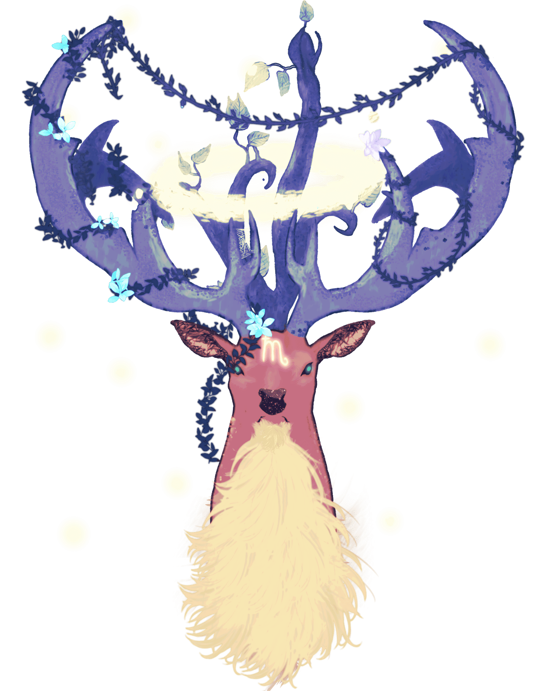

# October 26th (Challenge 25)

Prompt: **Secretive**

### [Phygius](https://github.com/mpanighetti/dnd5e-monsters/blob/main/fey/phygius.md)

#### Lore

Legend speaks of a giant deer with three massive horns atop its head, which appears and disappears within a forest tangled in planar energies. It is from these scarce sightings in the distant past that the [Middlestag Forest](https://github.com/mpanighetti/dnd5e-mote/blob/main/mote/esterfell/lenya/middlestag-forest.md) was given its name, but none of the local families have any more context on what the Middlestag is, where it comes from, and what it might want when it shows itself. Some have reported seeing this mighty creature appear to rapidly flicker in and out of existence, making it unclear whether what they saw was even real.

This cervid is in fact a powerful archfey named [Phygius](https://github.com/mpanighetti/dnd5e-mote/blob/main/pantheon/phygius.md). It resides in the Middlestag Forest as well as its intersections with adjacent planes, seemingly jumping erratically between them. Phygius is equally within its domain whether in the forest as it manifests in [Esterfell](https://github.com/mpanighetti/dnd5e-mote/blob/main/mote/esterfell/esterfell.md) or in the Feywild.

The leading theory to explain Phygius' strange interplanar nature is that it was transformed by falling [starstuff](https://github.com/mpanighetti/dnd5e-mote/blob/main/artifacts/starstuff.md) millennia ago, possibly during the impact that formed Esterfell itself. Such an infusion of stellar energies could dislodge a sufficiently powerful creature from its attachment to a single plane, causing its body to physically reside in multiple adjacent planes simultaneously and periodically settle on one or another before shifting away again.

It is unclear what effect such a state of being would have on a creature's psyche, and thus far none in Esterfell have reported successfully communicating with Phygius. The courts of the Feywild respect Phygius' power and tend to leave it to its own unknowable devices.

Phygius tends to make itself visible on the Esterfell side of the forest when the barriers between planes are weakened, be it by arcanists tampering with starstuff or an impending new stellar bombardment. It is said that seeing the Middlestag on a moonlit night is a sign of strange future occurrences to come, such as the sudden appearance of frightening otherworldly creatures and the disappearance of loved ones into the Feywild.

These movements of other beings across the planes are unlikely to be Phygius' doing; rather, it seems to have the innate ability to detect openings between worlds and is drawn to them. Whether it presides over these temporary tears in reality out of approval of the blending of worlds or whether it watches over these events to try and prevent disaster is unknown, but its perceived role as a harbinger has led to fear and superstition surrounding any sightings.

Farmers and hunters in the region might revere the Stag as a minor deity, but thus far the archfey seems completely indifferent to the affairs of most mortals of Esterfell, unless they dare to tug at the edges of reality and order and move between worlds. This will draw its attention, but it is thus far unclear whether being noticed by Phygius would have a positive outcome.

<figure>
  
  <figcaption>Phygius by <a href="https://twitter.com/200dollarHaru">Haru</a></figcaption>
</figure>

#### Attributes

_Large fey (archfey), chaotic neutral_

- **Armor Class** 20 (natural armor)
- **Hit Points** 607 (45d10 + 270)
- **Speed** 60 ft.

|  STR  |  DEX  |  CON  |  INT  |  WIS  |  CHA  |
|:-----:|:-----:|:-----:|:-----:|:-----:|:-----:|
|24 (+7)|26 (+8)|26 (+8)|21 (+5)|25 (+7)|26 (+8)|

- **Saving Throws** DEX +16, WIS +15, CHA +16
- **Skills** Insight +13, Intimidation +16, Perception +15, Persuasion +16
- **Damage Immunities**
- **Condition Immunities** Blinded, Charmed, Deafened, Force, Frightened, Exhausted, Grappled, Paralyzed, Poisoned, Stunned; Bludgeoning, Piercing, and Slashing from nonmagical attacks
- **Senses** Truesight 120 ft., passive Perception 25
- **Languages** Druidic, Sylvan, telepathy 120 ft.
- **Challenge** 25 (75,000 XP) **Proficiency Bonus** +8

#### Special Traits

_**Innate Spellcasting.**_ Phygius' innate spellcasting ability is Charisma (Spell Save DC 24). It can innately cast the following spells, requiring no components:

- At will: _dispel magic_, _druidcraft_, _faerie fire_
- 3/day each: _bless_, _charm monster_, _conjure animals_, _greater invisibility_, _moonbeam_, _plant growth_, _spike growth_, _suggestion_, _transport via plants_
- 1/day each: _color spray_, _crown of stars_, _druid grove_, _geas_

Spells under 5th level are cast at 5th level.

_**Interplanar Nature.**_ While in the Ethereal Plane, the Feywild, or the Material Plane, Phygius is aware of the location and alignment of all creatures within 30 feet of Phygius' corresponding location on each plane. Additionally, Phygius is immune to _banishment_ or similar spells or effects when it is on any of these planes. If Phygius dies on any plane other than the Feywild, its body is destroyed but its essence travels back to the Feywild, and it is unable to take physical form or planeshift for a time.

_**Legendary Resistance (3/Day).**_ If Phygius fails a Saving Throw, it can choose to succeed instead.

_**Limited Magic Immunity.**_ Unless it wishes to be affected, Phygius is immune to spells of 5th level or lower. It has advantage on Saving Throws against all other spells and magical effects.

_**Magic Weapons.**_ Phygius' weapon attacks are magical.

_**Regeneration.**_ Phygius regains 20 Hit Points at the start of its turn. If it takes Necrotic damage, this trait doesn't function at the start of its next turn. Phygius dies only if it starts its turn with 0 Hit Points and doesn't regenerate.

#### Actions

_**Multiattack.**_ Phygius makes up to two attacks, one with its horns and one with its hooves.

_**Horns.**_ _Melee Weapon Attack:_ +15 to hit, reach 10 ft., one target. _Hit:_ 40 (6d10 + 7) Piercing damage plus 18 (4d8) Force damage.

_**Hooves.**_ _Melee Weapon Attack:_ +15 to hit, reach 10 ft., one target. _Hit:_ 34 (6d8 + 7) Bludgeoning damage plus 14 (4d6) Thunder damage, and if they are a creature, they must succeed on a DC 22 Strength Saving Throw or be knocked Prone.

#### Bonus Actions

_**Fear Gaze.**_ Phygius stares at a creature within 30 feet of it and fills their mind with fear. The creature must make a DC 24 Wisdom Saving Throw. Unless the save succeeds, the creature is Frightened until the start of their next turn. If a creature's Saving Throw is successful, the creature is immune to Phygius' Fear Aura for the next 24 hours.

_**Teleport.**_ Phygius magically teleports, along with any equipment it is wearing or carrying and any number of creatures it targets within 30 feet, up to 120 feet to an unoccupied space it can see. Unwilling creatures must succeed on a DC 18 Wisdom Saving Throw or they are teleported along with Phygius.

#### Legendary Actions

Phygius can take 3 Legendary Actions, choosing from the options below. Only one Legendary Action option can be used at a time and only at the end of another creature's turn. Phygius regains spent Legendary Actions at the start of its turn.

**Arcane Disruption.** Phygius casts _dispel magic_.

**Shift (Costs 2 Actions).** Phygius magically planeshifts, along with any equipment it is wearing or carrying and any number of creatures it targets within 30 feet, to its corresponding location on the Ethereal Plane, the Feywild, or the Material Plane. Unwilling creatures must succeed on a DC 20 Wisdom Saving Throw or they are teleported along with Phygius. If a creature or object is present at the target location, they must succeed on a DC 23 Dexterity Saving Throw or take 13 (3d8) Force damage and be knocked Prone. Whether the creature or object succeeds or fails on the save, they are pushed to an unoccupied space of Phygius' choice within 10 feet.

**Teleport.** Phygius uses its Teleport action.
